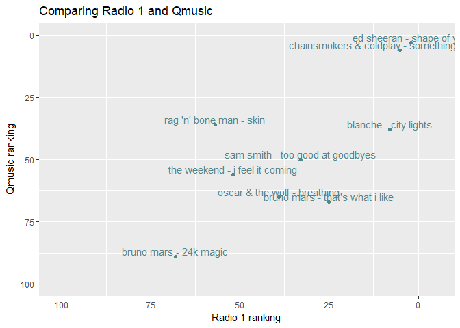

Who's on everyone's 2017 "hit list"?
====================================

 

At the end of the year, everyone is making lists. And radio stations are
no exceptions.  
Many of our radio stations have a weekly "people's choice" music chart.
Throughout the week, people submit their top 3 recent songs, and every
week those votes turn into a music chart. At the end of the year, they
collapse all those weekly charts into a larger one covering the entire
year.

I find this one quite interesting: it's not dependent on what music
people buy, it's determined by what the audience of that station wants
to hear. So what are the differences between these stations? And do they
match up with what I would expect?

What was also quite intriguing: in Dutch we call it a *hit lijst* and if
you translate that word for word you get: *hit list*. Which at least one
radio station seems to do... When I think of the word hit list, music is
not really what comes to mind, but hey, let's roll with it: which
artists are on their 'hit lists'?

 

About the data
--------------

I took 4 different radio stations:

-   Radio 1: The most serious of our public broadcast stations. It's
    aimed at current affairs, politics, news, ... When I think of Radio
    1 music, I think of Leonard Cohen, Marianne Faithfull, Nathaniel
    Ratecliff and Elbow.
-   Studio Brussels: Formerly known as the "rock station", but now it's
    really a mix of modern rock, pop, indie & dance music.
-   MNM: Described as the "contemporary hit radio station" of the public
    broadcast organisation
-   Q music: A commercial "contemporary hit radio station"

There is one major and annoying drawback in this dataset: Studio
Brussels does a top 30, while all the others do a top 100.

 

Loading all the packages needed:

    #for scraping
    library(rvest)
    library(xml2)

    #for cleanup and data manipulation
    library(dplyr)
    library(tidyr)

    #for graphing
    library(ggplot2)

 

Web Scraping Etiquette
----------------------

Before starting the scrape, I wanted to make sure that I was allowed to
do so using the rOpenSci robotstxt package:

    #Webscraping etiquette: am i allowed to scrape this site?
    robotstxt::paths_allowed("https://stubru.be/music/arcadefireopeenindeafrekening2017")
    robotstxt::paths_allowed("https://mnm.be/mnm50/dezesongstemdejijhetafgelopenjaartvaakstdemnm50")
    robotstxt::paths_allowed("https://radio1.be/vox-100-de-lijst-2017")
    robotstxt::paths_allowed("https://qmusic.be/hitlijsten/favoriete-100-2017")

    ## [1] TRUE
    ## [1] TRUE
    ## [1] TRUE
    ## [1] TRUE

 

Bad luck with the standard scraping procedures...
-------------------------------------------------

A quick search showed no APIs for any of these websites, so I started
with `rvest` and the usual CSS nodes routine. Unfortunately no CSS
element or XPATH gave me any useful information.

    #usual method
    read_html("https://stubru.be/music/arcadefireopeenindeafrekening2017") %>%
      html_nodes(css=".song-title")

    ## {xml_nodeset (0)}

 

The issue is that the website is rendered through Javascript, and R is
scraping the website before all the content is loaded. After a bit of
googling I found [a
tutorial](https://www.datacamp.com/community/tutorials/scraping-javascript-generated-data-with-r)
that had all the answers I needed.  

Scraping Javascript rendered websites
-------------------------------------

Through `phantomJS` you can create a representation of the website after
Javascript loaded all the data. Afterwards you can scrape the local
version.  
I opened a normal notepad and saved the following as `scrape_stubu.js`:

    var webPage = require('webpage');
    var page = webPage.create();

    var fs = require('fs');
    var path = 'scrape_stubru.html'

    page.open('https://stubru.be/music/arcadefireopeenindeafrekening2017', function (status) {
      var content = page.content;
      fs.write(path,content,'w')
      phantom.exit();
    });

 

Next, you use a `system` command in R to run the script and return a
local html version. You need `phantomJS` installed to do this, but you
can easily install it form [here](http://phantomjs.org/download.html).

    #generate local copies of all required websites
    system("./phantomjs/bin/phantomjs scrape_stubru.js")
    system("./phantomjs/bin/phantomjs scrape_qmusic.js")
    system("./phantomjs/bin/phantomjs scrape_mnm.js")

 

Scraping the data
-----------------

The javascript rendered websites all had quite similar structures, so I
wrote a function to extract the ranking, artist and title from the
website and return it as a dataframe.

    #function to scrap info
    scrape_music <- function(html, css_artist, css_title, css_ranking) {
      html_page <- read_html(html)
      
      #extracting song info
      artist <- html_page %>%
        html_nodes(css = css_artist) %>%
        html_text() %>%
        tolower()
      
      #extracting artist info
      title <- html_page %>%
        html_nodes(css = css_title) %>%
        html_text() %>%
        tolower()
      
      #extracting ranking
      ranking <- html_page %>%
        html_nodes(css = css_ranking) %>%
        html_text() %>%
        as.numeric()
      
      #making a dataframe
      df <- data.frame(ranking, artist, title, stringsAsFactors = FALSE)
      return(df)
    }

 

Using the function above, three radio stations were easily scraped. Two
of them needed no additional clean-up. Only Qmusic needed some extra
cleanup to remove a few "/n" signs.

    #scraping studio brussels
    stubru <- scrape_music(html = "scrape_stubru.html", css_artist = ".song-title",
                                css_title = ".song-name", css_ranking=".song-position")
    colnames(stubru) <- c("stubru_ranking", "artist", "title")

    #scraping mnm
    mnm <- scrape_music(html = "scrape_mnm.html", css_artist = ".song-name",
                           css_title = ".song-title", css_ranking=".song-position")
    colnames(mnm) <- c("mnm_ranking", "artist", "title")

    #scraping mnm
    qmusic <- scrape_music(html = "scrape_qmusic.html", css_artist = ".title-bar",
                        css_title = ".subtitle", css_ranking=".hitlist-position")
    colnames(qmusic) <- c("qmusic_ranking", "artist", "title")
    qmusic$title <- gsub("\n", "", qmusic$title)
    qmusic$artist <- gsub("\n", "", qmusic$artist)

 

Radio 1 was by far the trickiest. Even after rendering it through
`phantomJS` it kept returning no content in any of the CSS nodes
referring to the table containing the hit chart. Digging in the
`inspect element` view of the brower I found out that the table was
sourced from yet another page, but even on that page phantomJS didn't do
the job. (If anyone can tell me why, please do!)  
Luckily a couple of curses later, I discovered an API link in the source
code of the webpage.  
I was about to skip Radio 1 all together, but there it was...

    library(jsonlite)
    content2 <- fromJSON("https://hitlijst.vrt.be/api/lists/3594.json")

    #after finding where the data is sitting exactly:
    title <- tolower(content2$songs$title)
    artist <- tolower(content2$songs$name)
    radio1_ranking <- as.numeric(content2$songs$position)

    radio1 <- data.frame(radio1_ranking, title, artist, stringsAsFactors = FALSE)

 

Comparing the radio stations
----------------------------

I wrote a short function that compares the two dataframes via
`semi_join()` and then pastes a short sentence together with `paste`.
Not the most ingenious solution, but fast and useful enough.

 

Radio 1
-------

Regarding Radio 1, I would expect some moderate overlap with Studio
Brussels because they have the softer indie and rock music in common.
With the two pop hit

    ## [1] "Songs in common between Radio1 and Studio Brussels: 13 (out of 30)"
    ## [1] "Songs in common between Radio1 and MNM: 11"
    ## [1] "Songs in common between Radio1 and Qmusic: 9"

13 songs in common with Studio Brussels, and 5 of these are top 20 for
both audiences. Nothing hugely unexpected here.

    #plotting stubru versus radio 1
    radio1 %>%
      inner_join(stubru, by="title") %>%
      unite(combo, artist.x, title, sep=" - ") %>%
      ggplot(aes(x=radio1_ranking, y=stubru_ranking, label = combo))+
      geom_point(colour="cadetblue4") +
      scale_y_reverse(name = "Studio Brussels ranking") +
      scale_x_reverse(name = "Radio 1 ranking", limits=c(105,-10), breaks=c(0, 25, 50,75, 100)) +
      geom_text(vjust = 0, nudge_y = 0.5, colour="cadetblue4") +
      ggtitle("Comparing Radio 1 and Studio Brussels")

11 songs on both radio 1 and mnm: two of them are quite high on both: Ed
Sheeran and The Chainsmokers & Coldplay.

9 songs in common between radio1 and the commercial hit radio: again Ed
sheeran and The Chainsmokers & Coldplay.

Studio Brussels
---------------

As expected, there is most overlap between Studio Brussels and Radio1.

    ## [1] "Songs in common between Studio Brussels and Radio1: 13(out of 30)"
    ## [1] "Songs in common between Studio Brussels and MNM: 7(out of 30)"
    ## [1] "Songs in common between Studio Brussels and Qmusic: 5(out of 30)"

Versus the hitradios there are 5 to 7 songs in common. Ed Sheeran is
launching quite a trend in that upper right corner.

MNM and Q-music
---------------

Lastly, both hit radios against each other: I'm expecting massive
overlap between these two, but how massive exactly?  
Indeed a massive 61 songs in common.

    ## [1] "Songs in common between MNM and Qmusic: 61"
    ## [1] "Songs in common between MNM and Radio1: 11"
    ## [1] "Songs in common between MNM and Studio Brussels: 7"
    ## [1] "Songs in common between Qmusic and Radio1: 9"
    ## [1] "Songs in common between Qmusic and Studio Brussels: 5"

So much overlap, it's hardly readable, and espcially the upper right
corner is very populated, confirming that both audiences like the same
2017 songs.

 

The final hit list
------------------

From all the plots above I expected Ed Sheeran and The Chainsmokers &
Coldplay to be on the final list. But if I actually base myself on songs
rather than artists, Ed Sheeran is off the list because the RAdio 1 and
Studio Brussels audience can't agree on which song is the best. The
other two stations don't need any convincing: they put four of this
songs in their top 30.

    #the common hit list
    radio1 %>%
      inner_join(stubru, by="title") %>%
      inner_join(mnm, by="title") %>%
      inner_join(qmusic, by="title") %>%
      select(artist.x, title, radio1_ranking, stubru_ranking, mnm_ranking, qmusic_ranking) %>%
      knitr::kable(caption="Common songs on everyone's list",
                   col.names = c("Artist", "Title", "Radio1 #", 
                                 "Studio Brussels #", "MNM #", "Qmusic #")) 

<table>
<caption>Common songs on everyone's list</caption>
<thead>
<tr class="header">
<th align="left">Artist</th>
<th align="left">Title</th>
<th align="right">Radio1 #</th>
<th align="right">Studio Brussels #</th>
<th align="right">MNM #</th>
<th align="right">Qmusic #</th>
</tr>
</thead>
<tbody>
<tr class="odd">
<td align="left">chainsmokers &amp; coldplay</td>
<td align="left">something just like this</td>
<td align="right">5</td>
<td align="right">22</td>
<td align="right">3</td>
<td align="right">6</td>
</tr>
<tr class="even">
<td align="left">oscar &amp; the wolf</td>
<td align="left">breathing</td>
<td align="right">39</td>
<td align="right">18</td>
<td align="right">26</td>
<td align="right">65</td>
</tr>
</tbody>
</table>

But given that there was one station who only made a top 30, what
happens if I look at the ones with a longer list?  
A couple more heads about to roll then... Blanche, our Belgian
Eurovision Songfestival candidate is joining the mix, and so are Bruno
Mars, Sam Smith, Oscar and the Wolf and The Weekend.

    #amongst with a longer hit list
    radio1 %>%
      inner_join(mnm, by="title") %>%
      inner_join(qmusic, by="title") %>%
      select(artist.x, title, radio1_ranking, mnm_ranking, qmusic_ranking) %>%
      knitr::kable(caption="Common songs on the Top 100 list",
                   col.names = c("Artist", "Title", "Radio1 #", "MNM #", "Qmusic #"))

<table>
<caption>Common songs on the Top 100 list</caption>
<thead>
<tr class="header">
<th align="left">Artist</th>
<th align="left">Title</th>
<th align="right">Radio1 #</th>
<th align="right">MNM #</th>
<th align="right">Qmusic #</th>
</tr>
</thead>
<tbody>
<tr class="odd">
<td align="left">ed sheeran</td>
<td align="left">shape of you</td>
<td align="right">2</td>
<td align="right">4</td>
<td align="right">3</td>
</tr>
<tr class="even">
<td align="left">chainsmokers &amp; coldplay</td>
<td align="left">something just like this</td>
<td align="right">5</td>
<td align="right">3</td>
<td align="right">6</td>
</tr>
<tr class="odd">
<td align="left">blanche</td>
<td align="left">city lights</td>
<td align="right">8</td>
<td align="right">44</td>
<td align="right">38</td>
</tr>
<tr class="even">
<td align="left">bruno mars</td>
<td align="left">that's what i like</td>
<td align="right">25</td>
<td align="right">74</td>
<td align="right">67</td>
</tr>
<tr class="odd">
<td align="left">sam smith</td>
<td align="left">too good at goodbyes</td>
<td align="right">33</td>
<td align="right">43</td>
<td align="right">50</td>
</tr>
<tr class="even">
<td align="left">oscar &amp; the wolf</td>
<td align="left">breathing</td>
<td align="right">39</td>
<td align="right">26</td>
<td align="right">65</td>
</tr>
<tr class="odd">
<td align="left">the weekend</td>
<td align="left">i feel it coming</td>
<td align="right">52</td>
<td align="right">33</td>
<td align="right">56</td>
</tr>
</tbody>
</table>
